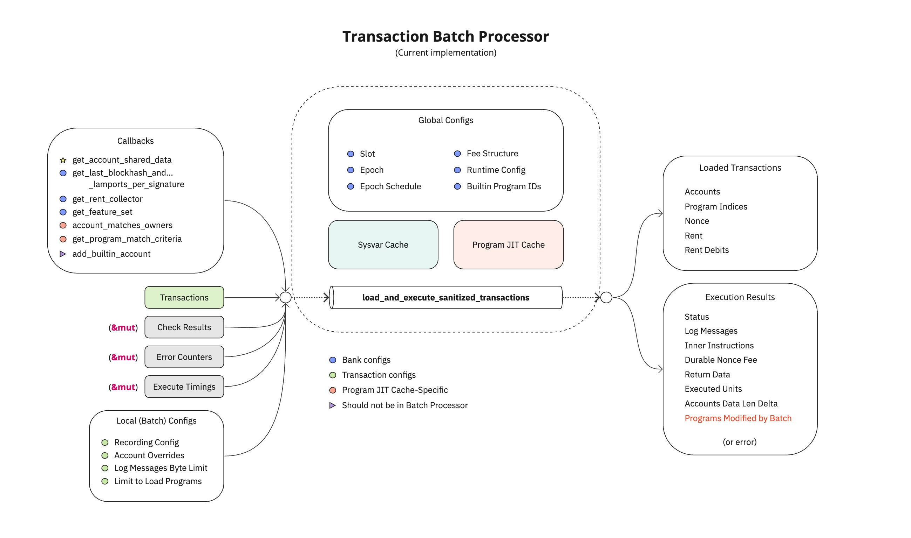
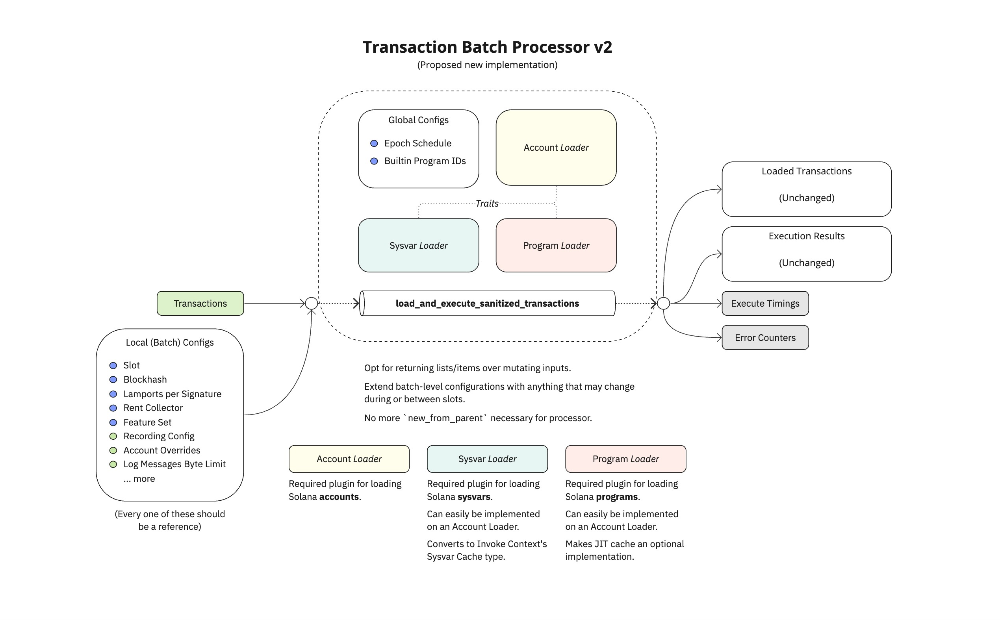

# PayTube

A demonstration of a Solana SVM-based payment channel for SPL tokens.

The `solana-svm` crate is a reimplemented version of Agave's `solana-svm`
crate.

The `paytube-svm` crate is the PayTube channel itself, leveraging the Solana
SVM and also providing its own implementations for the SVM API.

## Reimplementing Solana SVM

Below is a diagram of the current `solana-svm` crate's
`TransactionBatchProcessor` API.

Below is a diagram of the proposed new API, as implemented here in this
repository under `solana-svm`.

## Building on Top of Solana SVM

PayTube is a reference implementation designed to showcase how one might use
the `TransactionBatchProcessor` from `solana-svm` to build an SVM-based
service.

This particular service is a payment channel.

Read more [in the source](./paytube-svm/src/lib.rs).
